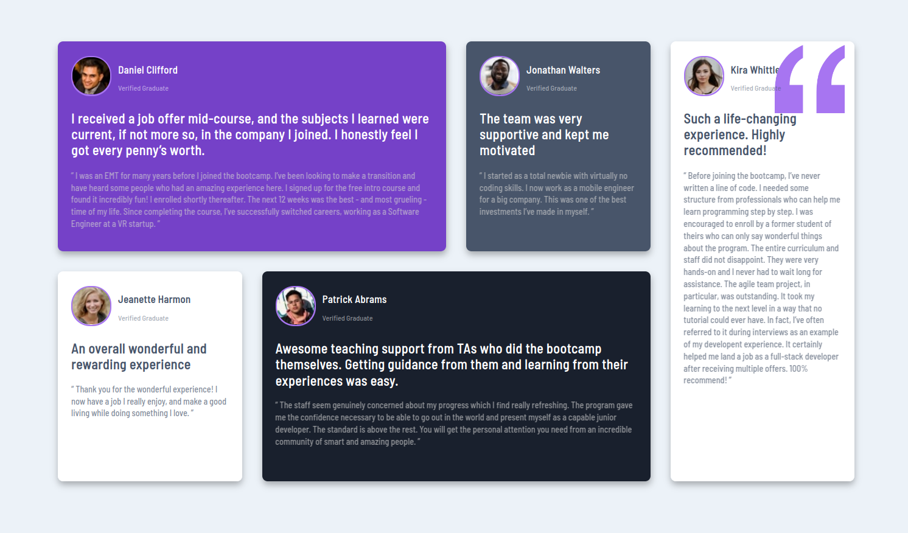

# Frontend Mentor - Testimonials grid section solution

This is a solution to the [Testimonials grid section challenge on Frontend Mentor](https://www.frontendmentor.io/challenges/testimonials-grid-section-Nnw6J7Un7). Frontend Mentor challenges helps to improve coding skills by building realistic projects. 

## Table of contents

- [Overview](#overview)
  - [The challenge](#the-challenge)
  - [Screenshot](#screenshot)
  - [Links](#links)
- [My process](#my-process)
  - [Built with](#built-with)
  - [What I learned](#what-i-learned)
  - [Continued development](#continued-development)
  - [Useful resources](#useful-resources)
- [Author](#author)
- [Acknowledgments](#acknowledgments)

## Overview

### The challenge

Users should be able to:

- View the optimal layout for the site depending on their device's screen size

### Screenshot




Add a screenshot of your solution. The easiest way to do this is to use Firefox to view your project, right-click the page and select "Take a Screenshot". You can choose either a full-height screenshot or a cropped one based on how long the page is. If it's very long, it might be best to crop it.

Alternatively, you can use a tool like [FireShot](https://getfireshot.com/) to take the screenshot. FireShot has a free option, so you don't need to purchase it. 

Then crop/optimize/edit your image however you like, add it to your project, and update the file path in the image above.


### Links

- : [MDN grid](https://developer.mozilla.org/en-US/docs/Web/CSS/grid)

## My process

### Built with

- Semantic HTML5 markup
- CSS custom properties
- Flexbox
- CSS Grid

### What I learned or i knew already

Highlight sample areas. For great way to reinforce your own knowledge.

```html
<div class="container">
      <div class="cards violet">
        <div class="card-head">
          
          <div class="image">
            
          </div>
          <div class="user">
            <h3>Daniel Clifford</h3>
            <p>Verified Graduate</p>
          </div>
        </div>
      </div>
</div>        
```
```css
``` using grid and its properties ```
@media (min-width: 1200px) {
  .container {
    display: grid;
    grid-template-columns: repeat(4, 1fr);
    grid-template-rows: repeat(2, 1fr);
    gap: 20px;
    max-width: 1200px;

  }
  .violet {
    grid-column: 1/3;
  }
  .white {
    grid-row: 2/-1;
  }
  .dark-grey {
    grid-column: 2/4;
  }
  .kira {
   grid-column: 4/5;
   grid-row: 1/3;
  } 
}
```
```cs using positive: relative
.container {
  position: relative;
  display: grid;
  gap: 20px;
  max-width: 1200px;
}
```

If you want more help with writing markdown, we'd recommend checking out [The Markdown Guide](https://www.markdownguide.org/) to learn more.

### Continued development

I coudl still use those testimonials styles in future projects.

### Useful resources

- [MDN Web Docs](https://developer.mozilla.org/en-US/docs/Web/CSS/grid-area) - This helped me for few implementations in my code. one of the best ways to understand code.
- [CSS GRID GENERATOR](https://angrytools.com/css-grid/) - This is an amazing article which helped me arranging grids, but afterwards still i modified it

## Author

- Github - [Giorgi Nareklishvili](https://gionare.github.io/testimonials-grid-section/)
- LinkedIn - [@gionare](https://www.linkedin.com/in/gionare/)

## Useful Screenshot 


